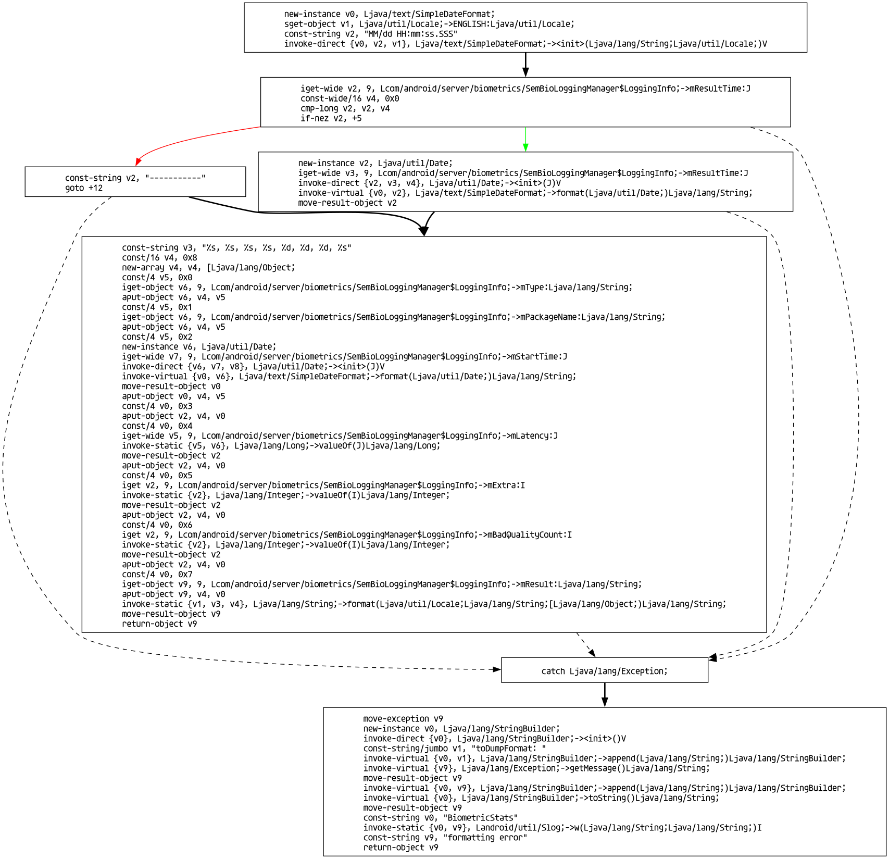

# Dalvik Bytecode Disassembler

Static analysis for Dalvik bytecode in Rust.

---

## Example

The method below (decompiled with jadx) generates the following graph view:

```java
    Locale locale = Locale.ENGLISH;
    SimpleDateFormat simpleDateFormat = new SimpleDateFormat("MM/dd HH:mm:ss.SSS", locale);
    try {
        return String.format(locale, "%s, %s, %s, %s, %d, %d, %d, %s", this.mType, this.mPackageName, simpleDateFormat.format(new Date(this.mStartTime)), this.mResultTime == 0 ? "-----------" : simpleDateFormat.format(new Date(this.mResultTime)), Long.valueOf(this.mLatency), Integer.valueOf(this.mExtra), Integer.valueOf(this.mBadQualityCount), this.mResult);
    } catch (Exception e) {
        Slog.w(SemBioLoggingManager.TAG, "toDumpFormat: " + e.getMessage());
        return "formatting error";
    }
```



## Usage

Create the image above (make sure you have `graphviz` installed):

```bash
cargo build -p smali-graphviz
./target/debug/smali-graphviz --help
./target/debug/smali-graphviz classes.dex 'com.android.server.biometrics.SemBioLoggingManager$LoggingInfo' toDumpFormat > x.dot
dot -Tpng x.dot > example.png
```
